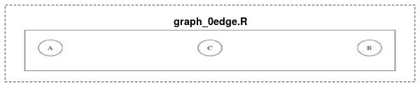
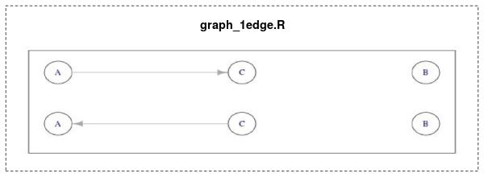
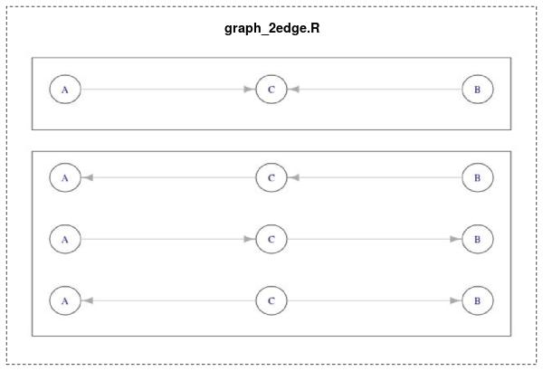

## Infer a three variable Bayesian network

$$
{\frac {\left(n!\right)\Gamma \left(\sum \alpha _{k}\right)}{\Gamma \left(n+\sum \alpha _{k}\right)}}\prod _{k=1}^{K}{\frac {\Gamma (x_{k}+\alpha _{k})}{\left(x_{k}!\right)\Gamma (\alpha _{k})}}
$$

## Number of Bayesian networks:

A V-variable network has $V(V-1)/2$ bivariate interaction (edges), each interaction can have 3 possible status (A->B, A<-B, A B). Hence altogether there are $n(V) = 3^{V(V-1)/2}$ possible networks. For $V=3$,$n(3)=27$


```{r,echo = F}
knitr::opts_chunk$set(
  echo = F
 # ,results = 'hide' ##### Will hide tables
 ,cache = F
 ,eval = T
 ,eval.after = c('fig.cap','code')
)
suppressPackageStartupMessages({
  source('dag.R')
  source('plot_dag.R')
})
```





### Comment on the likelihood-equivalent prior

The likelihood-equivalent prior is set so that the imaginary sample size decreases as data is stratified by more variables. For example, if $P(A=1) \sim Beta(\eta(A_0),\eta(A_1))$, then the imaginary sample size for (A=1) is $\eta(A_1)=2$. Hence if we then ask for $P(B=1\gvn A=1)\sim Beta(\eta(B_0A_1),\eta(B_1A_1))$, the prior must then be set so that the total imagnary sample size corresponds to that for A=1 ($\eta(B_0A_1)+\eta(B_1A_1)=\eta(A_1)=2$). Assuming two events are equally probable gives $\eta(B_0A_1)=\eta(B_1A_1)=1$. For 3 variable, we can deduce $8\eta(ABC)=4\eta(AB)=2\eta(A)=\eta(0)$, setting $\eta(ABC)=1$ gives $\eta(ABC)=1,\eta(AB)=2,\eta(A)=4,\eta(0)=8$, corresponding to different levels of stratification.

### Pitfall of binary bayesian networks

If there are hidden latent variables in the bayes net, for example where the common parent of A and B (which is C) is conceived from the observres, then one will have to consider a graph with hidden variable in order to explain the data. In other words, a graphical prior needs to accommodate additional nodes to explain such data. Even though this is the case, it will be hard to express the case where n(A_0)=n(B_0)

### Decomposing likelihood function with Dirichlet-multinomial, link it back to beta-binomial


### Effect of imaginary sample size

Setting $\eta(A)=1$ implies

$\eta(ABC)=0.25,\eta(AB)=0.5,\eta(A)=1,\eta(0)=2$

the corresponding likelihood are calculated

### Evaluate the networks

1. How does the imaginary sample size affects the likelihood?

### Plot posteiror for P(B=1|A=1) using \text{[A|C][C][B]} (equivalent to \text{[C|A][A][B]})

Because the model prescribed node B to be independent from node A, its prior takes the form:

$P(B=1\gvn A=1)=P(B=1)=\theta \sim Beta(4,4)$ if $\eta(A)=4\eta(ABC)=4$

Hence the posterior will only be informed by the marginalised counts of $B_0$ and $B_1$. Assuming $(B_0,B_1)$ follows binomial distribution, we can reuse rouines from \ref{sec:bayes-basics}.

(**TBC**)

###

```{r,results='hide'}
aM2bn <- function(aM,dat){
  # cat('\n','\n')
  # g = graph_from_adjacency_matrix(aM)
  # sess$mdlgraph = g
  # sess$preprocess()
  # sess$lp.node(1)%>%print
  eta0 = 1
  # lL = sess$logL(eta0=eta0,equiv=F)
  # lL %>%print
  # cat(lL,'\n')
  
  bn <- amat2bn(aM)
  # bn$logL = lL
  bn$iss = 2^nrow(aM) * eta0
  # bn$dat <- sess$dat
  bn$dat <- dat
  bn
}


{bn2df <- function(bn, iss=bn$iss){
  bnscore <- score(bn,bn$dat,'bde',iss=iss)
  bnscore <- score(bn,bn$dat,'bde',iss=iss)
  # bn
  myalgo.bde<- myalgo( amat(bn),bn$dat,eta0 = iss/8,equiv=F)
  list(model=modelstring(bn),myalgo.bde.iss=myalgo.bde,bnlearn.bde.iss=bnscore
       ,bnlearn.bic=score(bn,bn$dat,'bic')
       ,iss=iss
       )
}}


dfs = data.frame()

main <- function(dat = dat1,...){
# bn.list <- lapply(lst,aM2bn)
  f = partial(aM2bn,dat=dat)
  bn.list <- lapply(lst,f)
  # bn.list <- mapply(aM2bn,lst,dat)
  g <- partial(bn2df,...)
# df <- sapply(bn.list,g)
df <- Rutil::combine_args(rbind)(lapply(bn.list,g))
df <- Rutil::unlist.df(data.frame(df))
df <- cbind(df,dat= deparse(substitute(dat)))
}


```

```{r,fig.cap = cap,fig.show='hide'}
cap=''
dfs <- list()
df <- main(dat1,iss=8)
dfs <- rbind(dfs,df)
df <- main(dat1,iss=1)
dfs <- rbind(dfs,df)
bn = bnlearn::pc.stable(dat1)
png('pcalgo_dat1.png',height = 3,width=4.5,units = 'in',res=200)
par(mar=c(0,0,0,0))
plot(bn)
dev.off()
plot(bn)
```


```{r,height = 3,width=3,fig.show='hide'}
# dat = dat2
df <- main(dat2,iss=8)
dfs <- rbind(dfs,df)
df <- main(dat2,iss=1)
dfs <- rbind(dfs,df)
bn = bnlearn::pc.stable(dat2)
png('pcalgo_dat2.png',height = 3,width=4.5,units = 'in',res=200)
# dev.copy(dev.prev)
par(mar=c(0,0,0,0))
plot(bn)
dev.off()
plot(bn)
```

\begin{figure}
\includegraphics[width=0.45\textwidth]{pcalgo_dat1.png}
\includegraphics[width=0.45\textwidth]{pcalgo_dat2.png}
\caption{ \label{fig:pc-best}Best networks inferred using "bnlearn::pc.stable". Left: Dataset1. Right: Dataset2}
\end{figure}


\iffalse
\includegraphics[page=1,width=\paperwidth]{popgen_eqn_p3.pdf}
\fi


```{r}
options(digits = 6)
# bn <- bn.list[[2]]
# aMs
# plot(bn)
# bnlearn::modelstring(bn.list[[2]])
knitr::kable(dfs)
```
